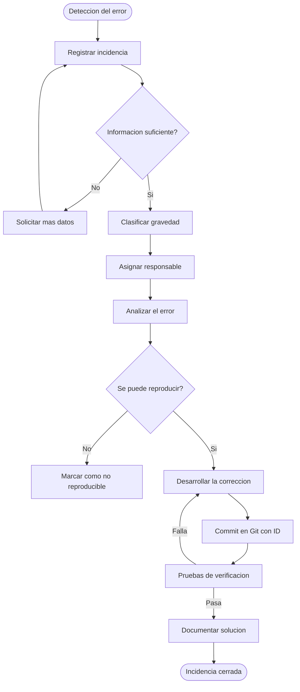

# Control de Calidad

## Introducción

Cuando desarrollas una tienda online como Velora Shop, no basta con que el código funcione en local y pase las pruebas básicas. Un e-commerce tiene partes muy concretas que pueden fallar en producción —el carrito, el login, la carga de imágenes— y si no tienes ninguna forma de medir qué está pasando, es muy difícil detectar los problemas antes de que afecten a los usuarios.

Los KPIs (indicadores clave de rendimiento) sirven exactamente para eso: poner números a aspectos del proyecto que normalmente solo se evalúan de forma subjetiva. Si sé que el tiempo de carga del catálogo supera los 3 segundos, o que hay un porcentaje elevado de errores en el proceso de checkout, puedo priorizar qué arreglar primero. En un proyecto de e-commerce como este, donde el flujo de compra tiene varios pasos encadenados (catálogo → producto → carrito → pedido), medir estos indicadores es especialmente importante porque un fallo en cualquier punto puede romper toda la experiencia del usuario.

Además, si en el futuro el proyecto crece y participan más personas en el mantenimiento, tener estos indicadores definidos facilita mucho la comunicación y la toma de decisiones.

---

## Tabla de KPIs

| # | Nombre del indicador | Definición / Cálculo | Frecuencia de medición | ✅ Correcto | ⚠️ Mejorable | ❌ Malo |
|---|---|---|---|---|---|---|
| 1 | **Tiempo de carga del catálogo** | Tiempo en milisegundos desde que se realiza la petición hasta que la página del catálogo es visible. Se mide con las DevTools del navegador (pestaña Network). | Semanal | < 1.500 ms | 1.500 – 3.000 ms | > 3.000 ms |
| 2 | **Tasa de errores en el login** | Porcentaje de intentos de inicio de sesión fallidos sobre el total. Cálculo: `(intentos fallidos / total intentos) × 100`. Se pueden registrar en un log de errores PHP. | Mensual | < 5% | 5% – 15% | > 15% |
| 3 | **Disponibilidad del servidor** | Porcentaje de tiempo en el que la aplicación está accesible y responde correctamente. En entorno local con XAMPP se puede comprobar manualmente; en producción con herramientas de monitoreo. Cálculo: `(tiempo activo / tiempo total) × 100`. | Mensual | > 99% | 95% – 99% | < 95% |
| 4 | **Errores SQL registrados** | Número de excepciones PDO capturadas en los logs durante un período. Incluye errores de conexión, consultas malformadas o violaciones de integridad. | Semanal | 0 errores | 1 – 3 errores | > 3 errores |
| 5 | **Productos sin stock** | Porcentaje de productos activos en el catálogo con `stock = 0`. Cálculo: `(productos con stock 0 / total productos activos) × 100`. | Semanal | < 10% | 10% – 25% | > 25% |
| 6 | **Errores en el proceso de carrito** | Número de fallos detectados al añadir, actualizar o eliminar productos del carrito (errores de validación, stock insuficiente no controlado, etc.). | Semanal | 0 errores | 1 – 2 errores | > 2 errores |
| 7 | **Valoración media de productos** | Media aritmética de todas las puntuaciones registradas en la tabla `valoraciones` (escala 1-5). Cálculo: `SUM(puntuacion) / COUNT(valoraciones)`. | Mensual | ≥ 4 / 5 | 3 – 3,9 / 5 | < 3 / 5 |
| 8 | **Vulnerabilidades de seguridad detectadas** | Número de vulnerabilidades identificadas durante revisiones de código o pruebas (SQL injection, XSS, acceso no autorizado, etc.). | Por sprint / versión | 0 | 1 (no crítica) | ≥ 1 crítica |
| 9 | **Tiempo medio de resolución de incidencias** | Tiempo promedio desde que se registra una incidencia hasta que se cierra como resuelta. Cálculo: `SUMA(fecha_cierre - fecha_apertura) / número_incidencias`. | Mensual | < 24 horas | 24 – 72 horas | > 72 horas |
| 10 | **Cobertura de casos de prueba funcionales** | Porcentaje de funcionalidades del proyecto cubiertas por casos de prueba documentados (ver sección 6 del TFG). Cálculo: `(funcionalidades probadas / total funcionalidades) × 100`. | Por versión | ≥ 90% | 70% – 89% | < 70% |

---

## Conclusión

Tener estos indicadores definidos no significa que haya que medirlos todos a la vez desde el principio. Lo más útil es empezar por los más críticos para el e-commerce —tiempo de carga, errores en el carrito, vulnerabilidades— e ir incorporando los demás conforme el proyecto crezca.

A largo plazo, estos KPIs serían la base para planificar mejoras: si el tiempo de carga sube de forma sostenida, puede ser señal de que hay consultas SQL que optimizar o imágenes demasiado pesadas. Si la valoración media cae, quizás hay problemas con la experiencia de compra. En resumen, estos indicadores convierten el mantenimiento de Velora Shop en algo proactivo en lugar de reactivo, y facilitan mucho la evolución del proyecto en el futuro.

---

---

# Gestión de Incidencias

## Formulario de incidencias

El siguiente formulario está pensado para registrar cualquier error o problema detectado en el proyecto Velora Shop, tanto en fase de desarrollo como en producción. Está diseñado para que pueda usarlo una sola persona o un equipo, de forma que toda la información quede documentada de forma clara y trazable.

### Formulario: Registro de Incidencia

| Campo | Detalle |
|---|---|
| **ID de incidencia** | INC-001 *(número correlativo, ej: INC-001, INC-002...)* |
| **Fecha de detección** | DD/MM/AAAA |
| **Hora de detección** | HH:MM |
| **Detectado por** | Nombre del usuario / desarrollador que detectó el problema |
| **Módulo afectado** | *(Seleccionar uno: Autenticación / Catálogo / Carrito / Pedidos / Panel Admin / Lista de Deseos / Valoraciones / Base de Datos / Seguridad / Otro)* |
| **Descripción del problema** | Explicación clara y concisa del error o comportamiento inesperado. |
| **Pasos para reproducir el error** | 1. ... 2. ... 3. ... |
| **Resultado esperado** | Qué debería ocurrir correctamente. |
| **Resultado obtenido** | Qué ocurre realmente (con el error). |
| **Gravedad** | *(Seleccionar una: 🔴 Crítica / 🟠 Alta / 🟡 Media / 🟢 Baja)* |
| **Estado** | *(Seleccionar uno: Abierta / En análisis / En desarrollo / Pendiente pruebas / Resuelta / Cerrada)* |
| **Responsable asignado** | Nombre de la persona encargada de resolver la incidencia. |
| **Entorno donde se produce** | *(Local XAMPP / Servidor de pruebas / Producción)* |
| **Evidencias** | Capturas de pantalla, mensajes de error, logs PHP... *(adjuntar o describir)* |
| **Solución aplicada** | Descripción de los cambios realizados para corregir el problema. |
| **Archivos modificados** | Lista de ficheros del proyecto que se han tocado para la corrección. |
| **Fecha de resolución** | DD/MM/AAAA |
| **Verificado por** | Nombre de quien ha comprobado que el error está corregido. |
| **Notas adicionales** | Observaciones, posibles mejoras relacionadas o riesgo de regresión. |

---

### Criterios de gravedad

| Gravedad | Descripción | Ejemplo en Velora Shop |
|---|---|---|
| 🔴 **Crítica** | El sistema no funciona o hay una brecha de seguridad activa. Requiere solución inmediata. | SQL injection explotable en el login / el carrito no procesa pedidos |
| 🟠 **Alta** | Funcionalidad importante no disponible, pero el sistema sigue funcionando parcialmente. | El panel de administración no carga / fallo en el registro de usuarios |
| 🟡 **Media** | Funcionalidad degradada o comportamiento incorrecto que no bloquea el uso principal. | Las valoraciones no se guardan / filtros por género no funcionan bien |
| 🟢 **Baja** | Problema menor, visual o de usabilidad, sin impacto real en el funcionamiento. | Una imagen de producto no carga / un texto con errata visible |

---

## Explicación del formulario

La idea de este formulario es que cualquier persona que trabaje en el proyecto —o el propio alumno cuando lo retome después de tiempo— pueda entender qué pasó, cómo reproducirlo y qué se hizo para solucionarlo, sin necesidad de recordarlo de memoria.

En la práctica, se utilizaría así: cuando se detecta un error (ya sea por pruebas propias, por un usuario del sistema o por los logs de PHP), se rellena el formulario inmediatamente con toda la información disponible. Se le asigna un ID correlativo (INC-001, INC-002...) para poder referenciarlo fácilmente en commits de Git o en el README del proyecto. El responsable asignado analiza el problema, lo corrige, documenta la solución aplicada y los ficheros modificados, y finalmente se cierra la incidencia una vez verificado que funciona correctamente.

Este sistema es especialmente útil para no perder el rastro de errores que se descubren durante el desarrollo y se "arreglan rápido sin apuntarlo", porque esos son precisamente los que vuelven a aparecer semanas después.

---

## Diagrama de flujo

---

## Explicación del proceso

El flujo empieza siempre en la detección del problema, que puede ocurrir de varias formas: durante las pruebas manuales, por un aviso del propio PHP (error en pantalla o en el log de XAMPP), o porque algo deja de funcionar de repente al hacer un cambio en el código.

Lo primero es registrarlo en el formulario antes de intentar arreglarlo, por muy pequeño que parezca. Muchas veces uno cree que va a tardar cinco minutos en solucionarlo y acaba cambiando media hora de código sin haber documentado nada.

Una vez registrado, se clasifica la gravedad para saber con qué urgencia hay que atenderlo. Si es crítico (por ejemplo, un fallo de seguridad o el carrito completamente roto), hay que parar lo que se esté haciendo y solucionarlo. Si es bajo, puede esperar a la siguiente sesión de trabajo.

El análisis consiste en revisar qué parte del código está fallando: ¿es el controlador, el modelo, una consulta SQL, una validación JavaScript? Una vez identificado el origen, se hace la corrección y se comprueba que funciona sin romper otras partes del proyecto (lo que se llama regresión). Es importante hacer el commit de Git con el ID de la incidencia en el mensaje, así queda trazabilidad entre el historial de cambios y los problemas reportados.

Finalmente, se actualiza el formulario con la solución aplicada, los ficheros modificados y la fecha de cierre. Así, si el mismo error vuelve a aparecer en el futuro, se puede consultar directamente qué se hizo la primera vez.
